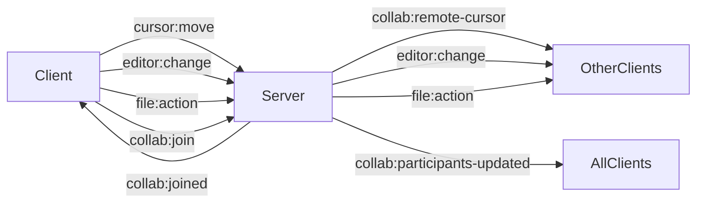

# CodeForge — Browser-Based Collaborative IDE

> A full-stack, browser-based IDE that executes Node.js projects entirely client-side via WebContainers, with real-time multi-user collaboration, live cursor synchronization, and direct GitHub repository integration — built on Next.js 15, Socket.IO, and React 19.

---

## Demo

### 📹 Demo Video
> *Coming soon — video demonstrating:*
> - Host creating a collaboration session
> - Guest joining and workspace snapshot initialization
> - Real-time cursor synchronization across users
> - File and folder CRUD synchronization
> - Recursive folder rename propagation across all participants
> - File deletion across all participants
> - WebContainer filesystem synchronization

### 🎞️ Demo GIF
> *Coming soon*

---

## Screenshots

| Landing Page | Editor |
|---|---|
|  |  |

| Collaboration | Terminal |
|---|---|
|  |  |

| GitHub Integration | Source Control |
|---|---|
|  |  |

---

## Features

### Core IDE
- **Browser-based execution** — runs React, Vue, Next.js, Svelte, and Node.js projects entirely in the browser via WebContainers; no server-side compute or Docker required
- **Monaco editor** — the same editor engine that powers VS Code, with syntax highlighting, per-language detection, and full keyboard shortcut support
- **Integrated terminal** — full shell access inside the browser with hot-reload support on file save
- **Project templates** — pre-configured starter templates for common frameworks to get running immediately
- **Autosave** — debounced background autosave (3s idle) syncs editor state to the database, with a `beforeunload` safety net for tab closes

### Real-Time Collaboration
- **Multi-user editing** — multiple users edit the same workspace simultaneously with full content synchronization
- **Live cursor synchronization** — remote cursors rendered as Monaco `IContentWidget` instances, with per-user color assignment and automatic 6-second stale cursor cleanup
- **Proximity warnings** — glyph margin indicators appear when collaborators are editing within a configurable line radius of each other
- **Presence panel** — shows active participants, their currently open file, and a real-time activity log
- **Follow mode** — lock your view to another user's cursor; automatically switches files as they navigate (press Escape to stop)
- **Host-guest model** — the session host controls the WebContainer runtime; the architecture differs between normal collab and GitHub collab (see Collaboration Workflow)

### File System Synchronization
- **Full CRUD sync** — file and folder create, delete, and rename operations propagate in real time to all participants' file trees and WebContainer filesystems
- **Recursive folder rename** — renaming a folder correctly updates every nested file's path in Zustand, manages folder entries explicitly, and applies a recursive copy-then-delete on the WebContainer filesystem (WebContainers expose no native rename API)
- **FileWatcher** — polling-based WebContainer filesystem watcher (2s interval) detects terminal-driven changes (`touch`, `rm`, `mv`) and syncs them back to the UI and all participants
- **Duplicate prevention** — `manuallyCreatedFilesRef` tracks UI-triggered operations with a 3s TTL so the FileWatcher never double-fires on paths the UI already handled

### GitHub Integration
- **Repository import** — load any GitHub repository directly into the editor with full file tree and content fetched via Octokit
- **Branch-aware workspace** — each branch maintains independent file state, open tabs, and change tracking
- **Staged changes** — modified, created, and deleted files are tracked separately using Zustand Sets
- **Direct commits** — commit changes directly to GitHub from the editor using the blob → tree → commit Octokit chain
- **Source control panel** — view per-file diffs, stage selectively, and discard individual file changes
- **Diff viewer** — inline Monaco diff view comparing original GitHub content (`remoteState`) against the working copy

### Authentication & Sessions
- **NextAuth v5** — GitHub and Google OAuth with server-side session management
- **Collaboration sessions** — shareable session links with configurable expiry; host presence is validated server-side before any guest is admitted
- **Multi-tab awareness** — a user opening multiple tabs creates multiple socket connections, each tracked in a `Set<socketId>` per participant; the "user left" event fires only when all tabs close

---

## Tech Stack

| Category | Technologies |
|---|---|
| **Frontend** | Next.js 15 (App Router), React 19, TypeScript |
| **Editor** | Monaco Editor (`@monaco-editor/react`) |
| **Backend** | Next.js API Routes, Custom Node.js HTTP Server |
| **Collaboration** | Socket.IO (WebSockets) |
| **Runtime** | WebContainers API (`@webcontainer/api`) |
| **Authentication** | NextAuth v5 — GitHub OAuth, Google OAuth |
| **Database** | MongoDB Atlas, Prisma ORM |
| **GitHub API** | Octokit REST |
| **State Management** | Zustand |
| **Caching** | Upstash Redis |
| **File Storage** | Vercel Blob |
| **AI** | Google Gemini API |
| **Styling** | Tailwind CSS, shadcn/ui |
| **Testing** | Vitest (481+ unit tests) |
| **CI/CD** | GitHub Actions, Docker |

---

## Architecture Overview

```
┌─────────────────────────────────────────────────────┐
│                     Browser                         │
│                                                     │
│  ┌─────────────┐   ┌──────────────┐  ┌──────────┐ │
│  │ Next.js 15  │   │  Socket.IO   │  │WebContain│ │
│  │ App Router  │   │  WS Client   │  │er Runtime│ │
│  └──────┬──────┘   └──────┬───────┘  └────┬─────┘ │
└─────────┼────────────────┼───────────────┼─────────┘
          │ HTTP            │ WebSocket     │ WASM/FS
          ▼                ▼               │
┌─────────────────────────────────────┐   │
│         Custom Node.js Server       │   │
│                                     │   │
│  ┌──────────────┐  ┌─────────────┐ │   │
│  │  Next.js     │  │ Socket.IO   │ │   │
│  │  Handler     │  │ Server      │ │   │
│  │  (HTTP)      │  │ (WS)        │ │   │
│  └──────┬───────┘  └──────┬──────┘ │   │
└─────────┼─────────────────┼─────────┘   │
          │                 │             │
          ▼                 ▼             │
┌─────────────────┐  ┌─────────────┐     │
│  MongoDB Atlas  │  │ GitHub API  │◄────┘
│  (Prisma ORM)   │  │ (Octokit)   │
└─────────────────┘  └─────────────┘
```

### Why a Custom HTTP Server?

Next.js's built-in server doesn't expose the raw Node.js `http.Server` instance, which Socket.IO needs to attach its WebSocket upgrade handler. Rather than running Socket.IO on a separate port (which would require CORS configuration and complicate deployment), CodeForge uses a custom `server.ts` entry point that creates one `http.Server`, passes it to both Next.js and Socket.IO, and listens on a single port.

```typescript
// server.ts — one server, two protocols
const httpServer = createServer(async (req, res) => {
  await handle(req, res, parsedUrl); // Next.js handles HTTP requests
});
const io = initSocketServer(httpServer); // Socket.IO intercepts WS upgrades
httpServer.listen(3000);
```

HTTP requests and WebSocket connections are differentiated at the TCP level by the presence of an `Upgrade: websocket` header — no port separation required.

### Socket.IO Event Architecture



Event names are intentionally asymmetric in some cases (`cursor:move` → `collab:remote-cursor`) to make data flow direction explicit at a glance.

---

## Collaboration Workflow

### 1. Session Initialization & Host Validation

The host creates a session linked to a playground or GitHub repository. A shareable session ID is stored in MongoDB. Crucially, guests are blocked at the **server level** — `socket.join(sessionId)` is only called after the server confirms the host's socket is present in the room. This prevents the race condition where a guest joins before the host and gets stuck in a broken state.

```
Host joins
  → socket.join(sessionId) ✅
Guest joins
  → server scans room for host socketId
  → host present? → socket.join(sessionId) ✅
  → host absent? → emit HOST_NOT_PRESENT → guest blocked ❌
```

### 2. Workspace Snapshot — GitHub Collab

When a guest joins a GitHub collab session mid-way, the clean GitHub tree (last committed state) doesn't reflect the host's uncommitted changes. To solve this, the guest requests a workspace snapshot from the host immediately after joining.

```
Guest joins
  → fetch clean GitHub tree (committed state)
  → emit workspace:request-snapshot
  → server relays to host
  → host serializes { files, modifiedFiles, createdFiles, deletedFiles }
  → server delivers directly to guest's socketId
  → guest applies snapshot on top of clean tree
  → workspace matches host exactly ✅

Fallback (host offline or 8s timeout)
  → guest proceeds with clean GitHub tree only
```

### 3. Editor Synchronization

Every keystroke emits a full-content `editor:change` event (Phase 1 — no delta encoding or operational transforms). The server broadcasts to all other participants. Receivers apply the content to their Zustand store and WebContainer filesystem simultaneously for immediate hot reload.

A `isRemoteChange` ref is set to `true` before calling `editor.setValue()` and cleared after 50ms. This prevents Monaco's internal `onDidChangeCursorPosition` event from firing back to the server when content is being applied from a remote source — which would otherwise create an infinite feedback loop.

### 4. Cursor Synchronization

```
User moves cursor
  → debounced 100ms → emit cursor:move
  → server rebroadcasts as collab:remote-cursor (different name — direction clarity)
  → receivers create/update Monaco IContentWidget
  → per-user color assigned on first appearance (8 colors, arrival order)
  → 6s inactivity → cursor removed (stale cleanup)
  → disconnect → cursor removed immediately
```

### 5. File Tree & WebContainer Synchronization

All structural operations broadcast a `file:action` event. An `isFolder: boolean` flag in the payload distinguishes file operations from folder operations, avoiding the need for separate event types.

| Operation | Sender does | Receiver does |
|---|---|---|
| Create file | `addFileToTree` + `markFileCreated` + WC write | Same, via `handleRemoteFileAction` |
| Delete file | `removeFileFromTree` + `markFileDeleted` + WC rm | Same |
| Rename file | Remove old + add new in Zustand + WC read/write/rm | Same |
| Create folder | `addFileToTree` (dir entry) + WC mkdir | Same |
| Delete folder | Remove all nested files + folder entry + WC rm recursive | Same |
| Rename folder | Update all nested paths + old/new folder entries + WC recursive copy+delete | Same |

> WebContainers expose no native rename API. Every rename — file or folder — is implemented as read-then-write-then-delete. For folder renames, this is done recursively.

### 6. WebContainer Strategy — Normal vs GitHub Collab

The two collaboration modes use fundamentally different WebContainer architectures, each chosen to match their data source:

**Normal Collab** — data lives in MongoDB (one source of truth):
- Only the host runs a WebContainer instance
- Guests relay file content to the host via `webcontainer:file-sync` socket events; the server forwards directly to the host's `socketId` (not the whole room)
- Structural operations from guests are applied to the host's WebContainer via `handleRemoteFileAction`, using a `useRef` to avoid stale closure issues

**GitHub Collab** — data is fetched independently from GitHub by each user:
- Every participant runs their own WebContainer instance
- File actions update each user's local WebContainer directly after receiving socket events
- No relay through the host; preview hot reloads happen with zero added latency

### 7. Multi-Tab Awareness

```
User opens Tab 1 → socket_001 → participant entry created { socketIds: Set["socket_001"] }
User opens Tab 2 → socket_002 → socketIds: Set["socket_001", "socket_002"]
Tab 1 closes     → socket_001 removed → socketIds: Set["socket_002"] → no "left" event
Tab 2 closes     → socket_002 removed → Set empty → "user left" broadcast ✅
```

### 8. Terminal-Driven File Changes (FileWatcher)

Because WebContainers don't emit filesystem events, a polling loop runs every 2 seconds comparing current vs known filesystem state. Detection order is strictly enforced to avoid misclassification:

```
checkForChanges()
  1. Build raw diffs: deletedFiles[], addedFiles[], deletedFolders[], addedFolders[]
  2. Folder renames first  → splice matched paths from all four arrays
  3. File renames          → splice matched paths
  4. Deletions             → fire for remaining deletedFiles + deletedFolders
  5. Creations             → fire for remaining addedFiles + addedFolders
```

This ordering ensures a terminal `mv pages/ pages2/` is detected as a single rename event rather than a delete-then-create pair that would incorrectly remove the folder from the UI before recreating it.

---

## Engineering Challenges

### 1. Stale Closure — WebContainer Instance Unavailable at Handler Registration

Socket event handlers are registered once when the socket connects. At that moment, the WebContainer instance is `null` — it initializes asynchronously over the next several seconds (downloading the WASM runtime, running `npm install`, booting the Node.js environment). When a file action event later arrives, the handler reads the stale `null` from its closure and silently skips the WebContainer sync.

**Why it's non-trivial:** Adding `webContainer` to the `useEffect` dependency array would force the socket listener to be torn down and re-registered every time the WebContainer state changes (loading, ready, server URL available) — creating a window where events can be missed between `socket.off` and `socket.on`.

**Solution:** A stable `useRef` is kept in sync with the latest WebContainer object via a dedicated `useEffect`. The socket handler reads from the ref at call time rather than from the closure — always accessing the current instance regardless of when the handler was originally registered.

```typescript
const webContainerRef = useRef(webContainer);
useEffect(() => { webContainerRef.current = webContainer; }, [webContainer]);

// handler reads from ref — never stale
if (isHostRef.current && webContainerRef.current.instance) { ... }
```

### 2. Recursive Folder Rename — No Native API

WebContainers expose `fs.readFile`, `fs.writeFile`, `fs.rm`, and `fs.mkdir` — but no `fs.rename` or `fs.cp`. Renaming a folder with nested content therefore requires a full recursive copy followed by deletion of the original. This must be applied correctly across every participant's independent WebContainer filesystem.

**Solution:** The sender broadcasts one `file:action` event with `isFolder: true` and the old/new paths. Every receiver implements the same recursive copy-then-delete locally:

```
copyDir(src, dest):
  mkdir dest
  for each entry in readdir(src):
    if directory → copyDir(src/entry, dest/entry)
    if file      → readFile(src/entry) → writeFile(dest/entry)
rm(src, { recursive: true })
```

The Zustand file tree also requires explicit management: all nested file paths are updated, the old `type: "dir"` entry is removed, and a new one is added. Without this, the old empty folder persists in the UI.

### 3. FileWatcher Double-Firing on UI Operations

When the UI creates a file (e.g. via the file tree dialog), it writes the file to the WebContainer filesystem directly. Two seconds later the FileWatcher polls, sees the new file, and calls `handleFileCreated` — which tries to add the file to the tree again, creating a duplicate entry and a second broadcast to all participants.

**Solution:** Before any UI-triggered file or folder operation, all affected paths (including all nested paths for folder renames) are added to a `manuallyCreatedFilesRef` Set with a 3-second TTL. The FileWatcher checks this Set first and skips any path it finds there.

```typescript
manuallyCreatedFilesRef.current.add(filePath);
setTimeout(() => manuallyCreatedFilesRef.current.delete(filePath), 3000);
// ... proceed with the actual operation
```

### 4. FileWatcher Event Priority Ordering

A terminal `mv pages/ pages2/` produces four simultaneous raw diffs: `pages/` deleted, `pages2/` created, all files under `pages/` deleted, all files under `pages2/` created. If deletions were processed before rename detection, the folder and its contents would be removed from the UI before the rename logic runs — leaving the tree in an empty state.

**Solution:** Raw diffs are computed upfront into four mutable arrays. Rename detection runs first and splices matched paths out of all four arrays before any callback fires. Deletions and creations only see what the rename step left behind. This ordering is also why folder rename detection runs before file rename detection — a folder rename implicitly accounts for all its nested file renames.

### 5. Guest Workspace Initialization — Diverged State at Join Time

GitHub collab's source of truth is split between GitHub (committed state, fetched via API) and the host's in-memory Zustand store (uncommitted changes). A guest fetching only the GitHub tree would be missing all of the host's local modifications, created files, and staged deletions — immediately out of sync.

**Solution:** Guests request a snapshot from the host via a server-relayed socket event. The host serializes their complete Zustand workspace state — including file contents from open tabs to capture unsaved edits — and sends it directly to the guest's socket ID. The guest applies this on top of the clean GitHub tree, arriving at the host's exact working state. An 8-second timeout with GitHub-only fallback handles cases where the host is unreachable.

### 6. Discard Propagation — Restore vs Create Ambiguity

When the host discards a folder rename (e.g. reverting `Pages1/` back to `Pages/`), it needs to broadcast two things per file: delete the new-path file, and restore the old-path file. Guests receiving a "create" event for the restored file would incorrectly mark it as a new file (`A` in source control) rather than a restored GitHub file (clean state).

**Solution:** A dedicated `broadcastFileRestore` function sets `isRestore: true` and includes the file's original `sha` in the payload. The receiver's `handleRemoteFileAction` branches on this flag — restores call `addFileToTree` with the real sha and `unmarkFileDeleted` (a new Zustand action added for this purpose), never `markFileCreated`. This keeps source control state accurate across all participants after a discard.

### 7. Rename-Back-to-Original Leaves Spurious Source Control Markers

Renaming a folder from `Pages/` → `Pages1/` → back to `Pages/` should result in a clean workspace. Instead, the second rename added `Pages/` to `createdFiles` (showing `A`) while it was still in `deletedFiles` (showing `D`) — double-marking files that are effectively unchanged.

**Solution:** `markFileCreated` now checks `remoteState` before adding to `createdFiles`. If the path exists in `remoteState`, it's a GitHub file being restored — so the deletion is unmarked instead of a creation being marked. The file ends up in neither `createdFiles` nor `deletedFiles`: a clean state with no source control markers.

### 8. Triple Socket Connection Per User

Each of the three main components (`CollabPlayground`, `CollabEditor`, `useCollabWebContainer`) independently called `useCollabSocket`, resulting in three simultaneous WebSocket connections per user — tripling server-side memory usage and causing each event to be handled three times with conflicting state updates.

**Solution:** `CollabPlayground` owns the single socket instance and passes it to child components via props. This is the correct pattern: a single connection owner, with consumers receiving the socket as a prop rather than creating their own.

### 9. Ghost Cursors on Idle

Remote cursors rendered as Monaco content widgets persist indefinitely if a user stops moving their cursor but stays connected — for example, when reading code or switching to another application. This leaves floating cursor decorations that no longer reflect anyone's actual position.

**Solution:** Each incoming `collab:remote-cursor` event resets a per-user `NodeJS.Timeout` stored in a `Map` inside a `useRef`. If no new cursor event arrives within 6 seconds, the timeout fires and removes the cursor from both the Zustand Map and the Monaco decoration layer. On disconnect, `collab:user-left` triggers immediate removal without waiting for the timeout.

---

## Development & Quality

### Dockerized Environment

The project includes a multi-stage `Dockerfile` (Node 20 Alpine base) and a `docker-compose.yml` for local development. The compose file connects to MongoDB Atlas rather than running a local container, keeping the setup lean.

```bash
# Build and run via Docker
docker compose up --build
```

### CI Pipeline (GitHub Actions)

Every push and pull request to `main` runs a three-job CI pipeline:

```
┌─────────────────────────────────────────────┐
│              GitHub Actions CI              │
│                                             │
│  ┌─────────┐  ┌───────────┐  ┌──────────┐ │
│  │  Lint   │  │   Test    │  │  Docker  │ │
│  │ & Type  │→ │ (Vitest   │→ │  Build   │ │
│  │  Check  │  │ 481+ tests│  │ Validate │ │
│  └─────────┘  └───────────┘  └──────────┘ │
└─────────────────────────────────────────────┘
```

All environment variables are mapped to GitHub Actions secrets. The pipeline fails fast — a TypeScript error or failing test blocks the Docker build step.

### Test Coverage

**481+ Vitest unit tests** covering:

| Module | What's tested |
|---|---|
| `useFileExplorer` | All CRUD operations, duplicate detection, path resolution, open file tab management |
| `useGitWorkspace` | Branch switching, change tracking, discard logic, staged vs unstaged state |
| Collaboration handlers | Socket event routing using a shared `fakeSocket` EventEmitter test utility |
| GitHub Integration | Octokit operations, rate limiting, path traversal guards, concurrent operation race conditions |

Tests follow the pattern: export `initialState`, reset in `beforeEach`, seed state, call real action, assert real state, mock only I/O boundaries. Mocking the implementation itself is avoided — tests catch real bugs by exercising actual logic.

---

## Folder Structure

```
.
├── app/                              # Next.js App Router
│   ├── (auth)/                       # Auth pages (sign in, sign up)
│   ├── playground/[id]/              # Solo playground route
│   ├── collab/[sessionId]/           # Collaboration route
│   └── api/                          # REST API routes
│
├── modules/
│   ├── auth/                         # NextAuth config and server actions
│   │
│   ├── playground/
│   │   ├── components/               # PlaygroundEditor, FileTree, Loader
│   │   ├── hooks/
│   │   │   ├── useFileExplorer.ts    # Zustand store — file tree + CRUD operations
│   │   │   ├── usePlayground.ts      # Playground data fetching
│   │   │   └── useAiSuggestions.ts   # Gemini AI inline suggestions
│   │   └── lib/                      # Path utilities, file ID generation, enrichment
│   │
│   ├── collaboration/
│   │   ├── components/
│   │   │   ├── CollabPlayground.tsx  # Normal collab session (template-based)
│   │   │   ├── GitHubCollabPlayground.tsx  # GitHub collab session
│   │   │   ├── CollabEditor.tsx      # Monaco editor with remote cursors
│   │   │   └── ParticipantsPanel.tsx # Presence + activity log panel
│   │   ├── hooks/
│   │   │   ├── useCollabSocket.ts        # WebSocket connection + typed emit helpers
│   │   │   ├── useCollabParticipants.ts  # Participant list + activity log state
│   │   │   ├── useCollabWorkspace.ts     # GitHub collab file sync bridge
│   │   │   ├── useRemoteCursors.ts       # Remote cursor state + stale cleanup
│   │   │   └── useProximityWarnings.ts   # Proximity glyph warning logic
│   │   └── workspaces/               # Collab workspace DB actions
│   │
│   ├── github/
│   │   ├── actions/                  # fetchRepositoryTree, commitAllChangesToGitHub
│   │   ├── components/
│   │   │   ├── GitHubFileTree.tsx    # File tree with staged change indicators
│   │   │   ├── SourceControlPanel.tsx
│   │   │   └── DiffViewer.tsx        # Monaco inline diff component
│   │   └── hooks/
│   │       ├── Usegitworkspace.ts    # Zustand store — GitHub file + change tracking
│   │       ├── useRestoreDraft.ts    # Draft restoration on session rejoin
│   │       └── useWorkspaceAutoSave.ts
│   │
│   └── webContainers/
│       ├── services/
│       │   ├── webContainer-services.ts  # Singleton WebContainer instance manager
│       │   └── fileWatcher.ts            # Polling-based filesystem change detector
│       ├── hooks/
│       │   ├── useWebContainer.ts            # Solo playground WebContainer hook
│       │   ├── useCollabWebContainer.ts      # Normal collab WC (host/guest split)
│       │   └── useWebContainerForGithub.ts   # GitHub collab WC (per-user instances)
│       └── components/
│           ├── WebContainerPreview.tsx   # Preview iframe + terminal layout
│           └── terminal.tsx              # xterm.js terminal with shell integration
│
├── lib/
│   ├── db.ts                         # Prisma client singleton
│   └── socket/
│       └── server.ts                 # Socket.IO server — all event handlers, session state Maps
│
├── prisma/
│   └── schema.prisma
│
├── server.ts                         # Custom Node.js HTTP server entry point
├── Dockerfile                        # Multi-stage Docker build (Node 20 Alpine)
├── docker-compose.yml
├── .github/workflows/ci.yml          # GitHub Actions CI pipeline
│
└── __tests__/                        # Vitest unit tests (481+ tests)
    ├── useFileExplorer.test.ts
    ├── useGitWorkspace.test.ts
    └── collab/
```

---

## Installation

### Prerequisites

- Node.js 20+
- MongoDB Atlas account
- GitHub OAuth App
- Google OAuth credentials (optional)

### Setup

```bash
# Clone the repository
git clone https://github.com/Swanand-14/Code_AI_Editor.git
cd Code_AI_Editor

# Install dependencies
npm install

# Configure environment variables
cp .env.example .env.local
# Edit .env.local with your credentials (see Environment Variables below)

# Push the Prisma schema to MongoDB
npx prisma db push

# Start the development server
npm run dev
```

The app will be available at `http://localhost:3000`.

> **Note:** WebContainers require two HTTP response headers — `Cross-Origin-Opener-Policy: same-origin` and `Cross-Origin-Embedder-Policy: require-corp` — to enable the `SharedArrayBuffer` API. These are configured automatically in `next.config.js` for all routes that render the editor.

### Docker

```bash
# Build and run with Docker Compose
docker compose up --build

# Run tests inside the container
docker compose run app npm test
```

---

## Environment Variables

```env
# Database
DATABASE_URL=mongodb+srv://...

# NextAuth
NEXTAUTH_SECRET=
NEXTAUTH_URL=http://localhost:3000

# GitHub OAuth
GITHUB_CLIENT_ID=
GITHUB_CLIENT_SECRET=
GITHUB_ACCESS_TOKEN=       # Personal access token for Octokit API operations

# Google OAuth (optional)
GOOGLE_CLIENT_ID=
GOOGLE_CLIENT_SECRET=

# App
NEXT_PUBLIC_APP_URL=http://localhost:3000

# Upstash Redis (rate limiting / caching)
UPSTASH_REDIS_REST_URL=
UPSTASH_REDIS_REST_TOKEN=

# Vercel Blob (file storage)
BLOB_READ_WRITE_TOKEN=

# Gemini API (AI inline suggestions)
GEMINI_API_KEY=
```

---

## Future Improvements

| Improvement | Why it matters |
|---|---|
| **CRDT / Operational Transforms** | Replace full-content sync with delta-based conflict resolution (e.g. Yjs) to handle true concurrent edits without last-write-wins |
| **Shared terminal** | Broadcast terminal I/O bidirectionally so all participants interact with the same shell session |
| **Voice collaboration** | WebRTC voice channels scoped to collaboration sessions |
| **Collaborative debugging** | Shared breakpoints and step-through via the Chrome DevTools Protocol |
| **Deployment from editor** | One-click deploy to Vercel or Railway directly from a session |
| **Persistent terminal history** | Extend beyond the current 1000-line server buffer for late joiners |
| **Session recording** | Record and replay collaboration sessions for async code review |
| **Granular presence** | Show which specific line each collaborator is viewing, not just which file |

---

## License

MIT License — Copyright (c) 2025 Swanand

Permission is hereby granted, free of charge, to any person obtaining a copy of this software and associated documentation files (the "Software"), to deal in the Software without restriction, including without limitation the rights to use, copy, modify, merge, publish, distribute, sublicense, and/or sell copies of the Software, and to permit persons to whom the Software is furnished to do so, subject to the following conditions:

The above copyright notice and this permission notice shall be included in all copies or substantial portions of the Software.

THE SOFTWARE IS PROVIDED "AS IS", WITHOUT WARRANTY OF ANY KIND, EXPRESS OR IMPLIED, INCLUDING BUT NOT LIMITED TO THE WARRANTIES OF MERCHANTABILITY, FITNESS FOR A PARTICULAR PURPOSE AND NONINFRINGEMENT. IN NO EVENT SHALL THE AUTHORS OR COPYRIGHT HOLDERS BE LIABLE FOR ANY CLAIM, DAMAGES OR OTHER LIABILITY, WHETHER IN AN ACTION OF CONTRACT, TORT OR OTHERWISE, ARISING FROM, OUT OF OR IN CONNECTION WITH THE SOFTWARE OR THE USE OR OTHER DEALINGS IN THE SOFTWARE.